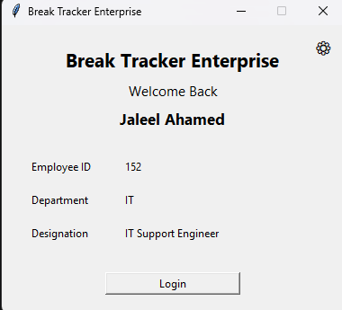
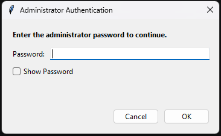
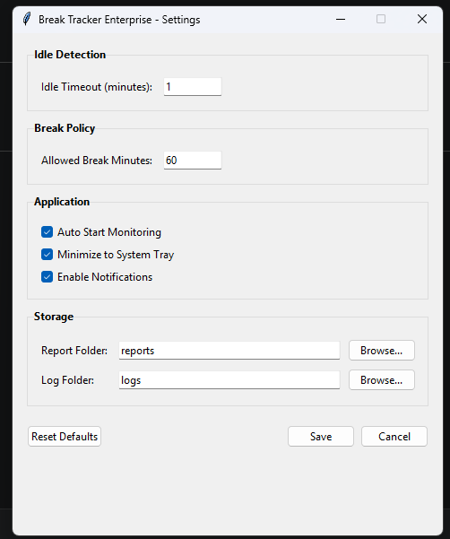
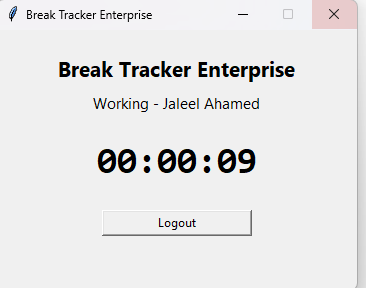
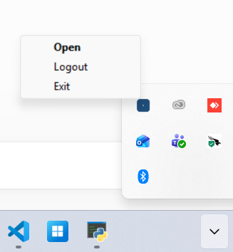
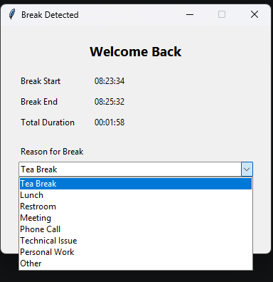
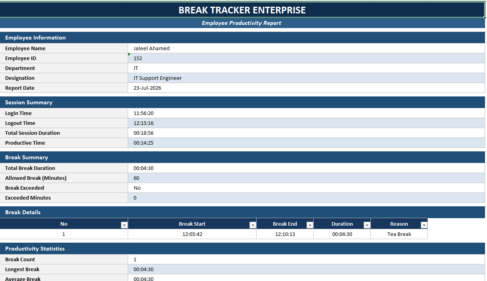
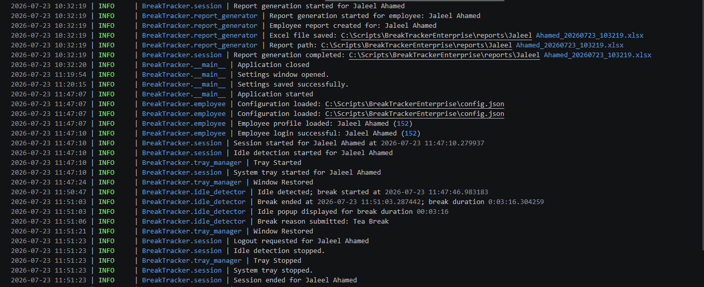

# Break Tracker Enterprise

Enterprise Desktop Productivity Monitoring System

> A modular Python desktop application for monitoring employee work sessions, detecting idle time, recording break reasons, generating professional Excel reports, and providing secure administrator controls.

---

## 📌 Table of Contents

- Overview
- Features
- Screenshots
- Architecture
- Project Structure
- Technology Stack
- Installation
- Configuration
- Administrator Features
- Excel Reporting
- Logging
- Documentation
- Roadmap
- Version
- License
- Author
# 🚀 Break Tracker Enterprise

Break Tracker Enterprise is a modular desktop productivity monitoring system developed in Python for Windows environments.

The application automates employee session tracking, detects idle time, collects break reasons, generates professional Excel productivity reports, and provides secure administrator controls for configuration management.

Designed using a modular architecture, the project follows enterprise software engineering practices including structured logging, secure administrator authentication, configuration management, and professional reporting.

This project was developed through an agile sprint-based approach and currently represents Version 1.0.0 of the application.
# ✨ Features

## Employee Features

- Employee Registration
- Secure Employee Login
- Live Session Timer
- Automatic Logout Report
- Idle Time Detection
- Break Reason Collection
- Background Monitoring
- Minimize to System Tray

---

## Administrator Features

- Protected Settings Window
- SHA-256 Password Authentication
- Temporary Lockout Protection
- Configuration Management
- Professional Logging
- Enterprise Report Generation

---

## Reporting

- Employee Information
- Session Summary
- Break Summary
- Productivity Statistics
- Automatic Remarks
- Professional Excel Formatting

---

## Logging

- Application Logs
- Error Logs
- Exception Tracking
- Authentication Logs


# 📸 Screenshots

### 1. Employee Login

The application begins with a secure employee login screen where users authenticate using their Employee ID before starting a work session.


 

 
### 2. Administrator Authentication

Administrative settings are protected with an additional authentication layer. Only authorized administrators can modify enterprise configuration settings.



### 3. Enterprise Settings

The administrator can configure application settings such as idle threshold, allowed break duration, notifications, and report/log locations.



### 4. Active Work Session

After login, the employee dashboard displays the active session timer while monitoring user activity in the background.



### 5. Background Monitoring

The application minimizes to the Windows System Tray, allowing continuous monitoring without interrupting the user's workflow.



### 6. Automatic Break Detection

When user inactivity exceeds the configured threshold, the application prompts the employee to provide a reason for the detected break.




### 7. Professional Excel Reports

At the end of each session, the application automatically generates a professionally formatted Excel report containing:

- Employee Information
- Session Summary
- Break Details
- Work Statistics
- Daily Activity Report



### 8. Enterprise Logging

Application and error logs are automatically maintained to simplify troubleshooting and auditing.



# 🏗️ Architecture

                     +-------------------+
                     |      main.py      |
                     +---------+---------+
                               |
         +---------------------+---------------------+
         |                     |                     |
         |                     |                     |
+--------v--------+   +--------v--------+   +--------v--------+
|  employee.py    |   |    logger.py    |   |  settings.py    |
+--------+--------+   +-----------------+   +--------+--------+
         |                                         |
         |                                         |
+--------v--------+                     +----------v----------+
|   session.py    |                     |   admin_auth.py     |
+--------+--------+                     +---------------------+
         |
         |
+--------+--------+
| idle_detector.py|
+--------+--------+
         |
         |
+--------v--------+
| report_generator|
+-----------------+
         |
         |
+--------v--------+
| tray_manager.py |
+-----------------+

# 📁 Project Structure

```text
BreakTrackerEnterprise/

assets/
docs/
logs/
reports/
screenshots/

main.py
employee.py
session.py
idle_detector.py
report_generator.py
logger.py
tray_manager.py
settings.py
admin_auth.py
admin_settings.py
config.json
README.md
CHANGELOG.md
LICENSE
VERSION
```

# 🛠️ Technology Stack

- Python 3.13
- Tkinter
- OpenPyXL
- PyStray
- Pillow
- JSON
- Logging
- Threading
- Git
- GitHub

# ⚙️ Installation

Clone the repository:

```bash
git clone https://github.com/JaleelAhamed/BreakTrackerEnterprise.git
```

Navigate into the project:

```bash
cd BreakTrackerEnterprise
```

Install dependencies:

```bash
pip install -r requirements.txt
```

Run the application:

```bash
python main.py
```


# 🔧 Configuration

Application settings are stored in:

config.json

Administrators can configure:

- Idle Time Threshold
- Allowed Break Duration
- Working Hours
- Administrator Authentication
- Application Behavior

# 📚 Documentation

Detailed project documentation is available in the `docs/` folder.

- Software Requirements Specification (SRS)
- Architecture Document
- Project Charter
- Roadmap
- User Guide
- Test Plan
- Release Notes

# 🗺️ Roadmap

## Version 1.0.0

- Employee Registration
- Secure Login
- Idle Detection
- Excel Reporting
- Enterprise Logging
- System Tray Support
- Administrator Authentication

## Version 2.0 (Planned)

- Database Integration
- Centralized Dashboard
- Team Analytics
- Email Reports
- Active Directory Integration
- RBAC
- Cloud Synchronization

# 📦 Current Version

Version: **1.0.0**

Status: **Production Ready (Pilot Deployment)**

Platform: Windows

Language: Python

# 📄 License

This project is licensed under the MIT License.

# 👨‍💻 Author

**Jaleel Ahamed**

IT Support Engineer

LinkedIn:
https://linkedin.com/in/jaleel-ahamed-tech

GitHub:
https://github.com/JaleelAhamed